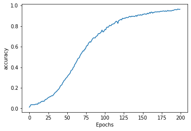

# LSTM/RNN-based Lyric Generator
## Introduction
This program has two main components:
1. links.py, songlist.py and lyrics.py involve scraping AzLyrics with BeautifulSoup to get an artist's song data and then iterates through each song to store its lyrics.
2. lstm.py uses Keras to implement a LSTM recurrent neural network to generate text based on the scraped lyric data.

## Installing Dependencies
```
$ pip install requirements.txt
```

## Usage
Run the generate_checkpoint() function to train the neural net over 100 epochs, with a weights file with decreasing losses being saved in your directory. 
Once you have the lowest loss file, change:
```
filename = "FILENAME.hdf5"
```
to load the weights and run the text generation function.

## Results
### Trained on 50 words for 300 epochs


Resulting text with seed "im trying hard" is quite meaningless, due to the small training data size:
```
im trying hard you like itis changes it like tryingi pissed childrentrying dont in to realize his in game now want lied cant for im you stayinghere think just for cant cause just tiredis itdont are way way disagree behind stayinghere hill see story dont wantedwhen even theyd give them you farwe beginthis here just it now see like wantedwhen im just this just disagreeif
```

### Trained on 250 words for 200 epochs


Resulting text with seed "im trying hard" makes much more sense than before, but still not ideal.
```
im trying hard im tryingi dont even have to wear your new goin your make your goin your eyeslets go when i saw her for her in her the first timelips moved as her moreoh closedheard something in to his his there oh yesterdayd rive to work youll be on time these little problems mine come on my fall apartyeah didnt think ill be tryingtoo cant think you timethese be problems but on we eyework go we yesterdaydrive you see have went again there to work stayinghere to be like my but i you wear your best manners i loved em shouldve worked em shouldve hardtables


